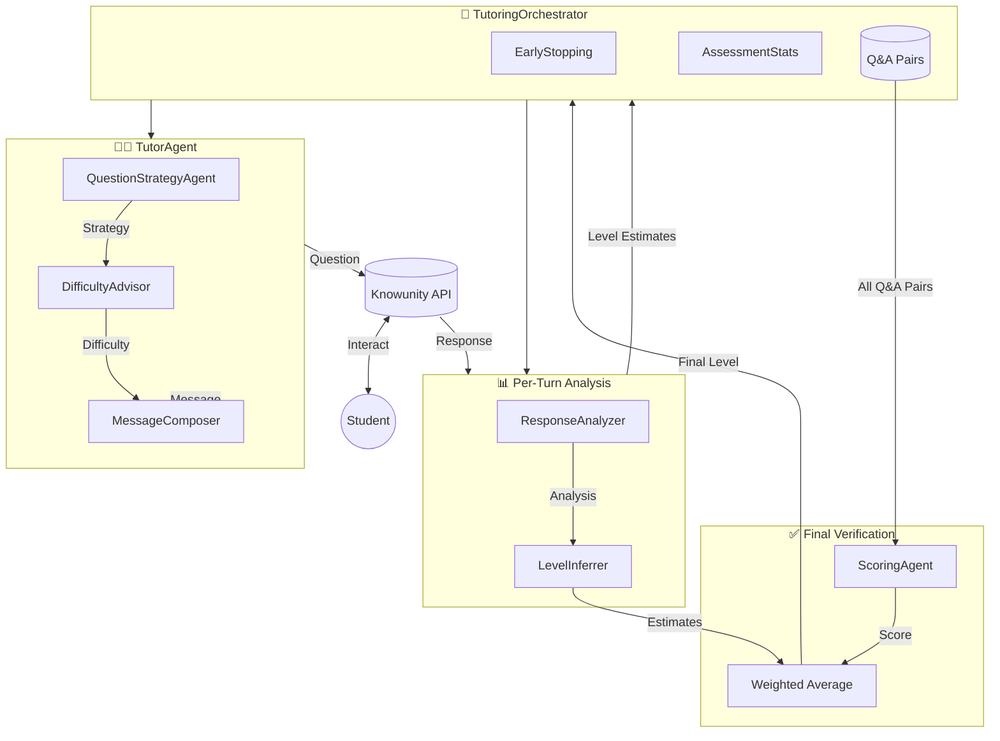

# 🎓 FBDSM - Adaptive AI Tutoring Agent


An intelligent, adaptive tutoring system that uses a multi-agent architecture to assess student skill levels and deliver personalized learning experiences.

## ✨ Features

- **Adaptive Skill Assessment** — Uses binary-search-style questioning to efficiently determine student skill levels (1-5)
- **Multi-Agent Architecture** — Specialized agents for strategy, difficulty, response analysis, and message composition
- **Early Stopping** — Intelligently concludes assessments when confidence is high, reducing session length
- **Async Evaluation Framework** — Concurrent evaluation across multiple students and topics

---

## 🏗️ Architecture

The system uses a hierarchical multi-agent architecture with the `TutoringOrchestrator` coordinating specialized agents:



### Agent Responsibilities

| Agent | Role |
|-------|------|
| **TutoringOrchestrator** | Coordinates the tutoring session, manages turns, and aggregates assessment statistics |
| **TutorAgent** | Orchestrates sub-agents to generate appropriate questions and responses |
| **QuestionStrategyAgent** | Decides which skill to probe using binary-search logic |
| **DifficultyAdvisor** | Recommends appropriate difficulty based on current level estimate |
| **MessageComposer** | Formulates student-facing messages with proper pedagogy |
| **ResponseAnalyzer** | Analyzes student responses for correctness and understanding |
| **ScoringAgent** | Final verification: scores entire conversation from accumulated Q&A pairs |
| **LevelInferrer** | Infers skill level from accumulated session data |

---

## 📁 Project Structure

```
knowunity_agent/
├── src/fbdsm/
│   ├── agents/                 # All agent implementations
│   │   ├── base.py             # Abstract Agent base class
│   │   ├── tutor_agent.py      # Main tutor orchestrating sub-agents
│   │   ├── question_strategy.py
│   │   ├── difficulty_advisor.py
│   │   ├── message_composer.py
│   │   ├── response_analyzer.py
│   │   ├── scoring_agent.py
│   │   └── level_inferrer.py
│   ├── orchestrator.py         # TutoringOrchestrator - main session controller
│   ├── evaluation.py           # Async evaluation framework
│   ├── early_stopping.py       # Early termination logic
│   ├── models.py               # Pydantic data models
│   ├── api.py                  # Knowunity API client
│   ├── student.py              # Student state management
│   └── config.py               # Configuration settings
├── scripts/                    # CLI scripts
│   ├── evaluate.py             # Run evaluations
│   └── test_*.py               # Test scripts
└── eval_results/               # Saved evaluation results
```

---

## 🚀 Getting Started

### Prerequisites

- Python 3.12
- [uv](https://docs.astral.sh/uv/) (recommended) or pip

### Installation

```bash
# Clone the repository
git clone <repository-url>
cd knowunity_agent

# Install with uv (recommended)
uv sync

# Or with pip
pip install -e .
```

### Configuration

Create a `.env` file from the example:

```bash
cp .env.example .env
```

Configure your environment variables in `.env`:

```env
# API Configuration
KNOWUNITY_API_KEY=your_api_key_here

# Model Configuration (pydantic-ai / OpenRouter)
OPENROUTER_API_KEY=your_openrouter_key
```

---

## 📖 Usage

### Run Evaluation

```bash
# Run on mini_dev dataset
python scripts/evaluate.py --dataset mini_dev

# Run with custom settings
python scripts/evaluate.py --dataset dev --max-turns 5 --max-concurrent 3
```

### Quick Test (Single Session)

```python
import asyncio
from fbdsm.orchestrator import run_quick_test

# Run a quick test with a specific student/topic
asyncio.run(run_quick_test(student_id="...", topic_id="..."))
```

### Programmatic Evaluation

```python
import asyncio
from fbdsm.evaluation import Evaluator

async def main():
    evaluator = Evaluator(dataset="mini_dev", max_turns=3)
    results = await evaluator.run_evaluation()
    evaluator.print_report()

asyncio.run(main())
```

---

## ⚙️ Configuration Options

| Environment Variable | Description | Default |
|---------------------|-------------|---------|
| `KNOWUNITY_API_KEY` | API key for Knowunity platform | — |
| `OPENROUTER_API_KEY` | API key for OpenRouter LLM access | — |

| Evaluator Parameter | Description | Default |
|--------------------|-------------|---------|
| `dataset` | Dataset to evaluate (`mini_dev`, `dev`, `test`) | `mini_dev` |
| `max_turns` | Maximum turns per tutoring session | `3` |
| `max_concurrent` | Maximum concurrent student evaluations | `3` |

---

## 🤝 Contributing

Contributions are welcome! Please open an issue or submit a pull request.

---

## 📄 License

This project is licensed under the MIT License.
